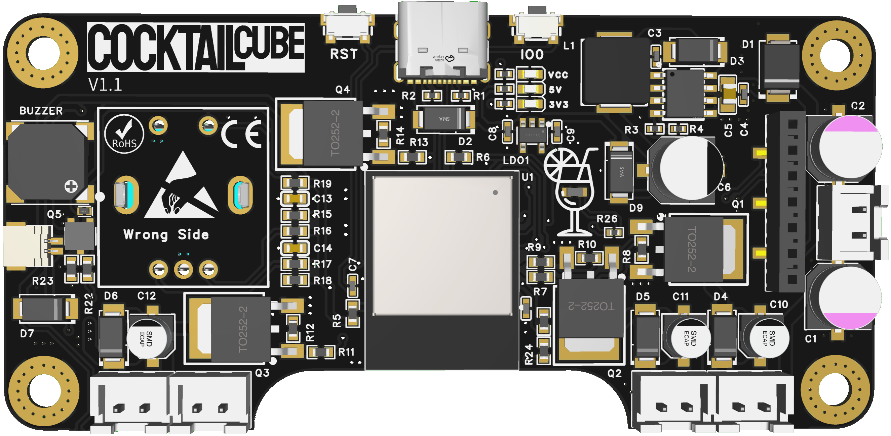
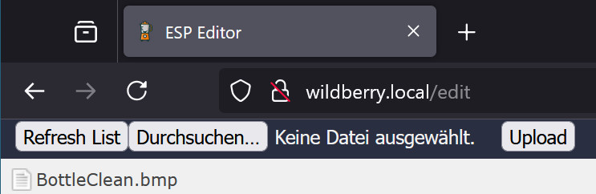
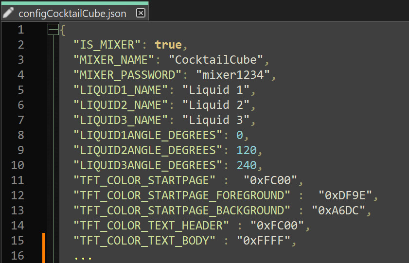

# CocktailCube
Sourcecode for CocktailCube Devices powered by ESP32-S2 custom board (PCB)

You can download the 3D print files required for the assembly from cults. When you buy a kit or PCB from Aliexpress, the 3D print files are included!

Page | Link
-------- | --------
Cults: | <a href="https://cults3d.com/:XXXXXXXX">https://cults3d.com/:XXXXXXXX</a>

You can buy the CocktailCube PCB or the full cocktailcube from AliExpress
https://s.click.aliexpress.com/e/_oBPfSOm

Page | Option
-------- | --------
PCB: | 1
PCB + Hardware: | 2
PCB + Hardware + Printparts: | 3

Images:

___

Releases (From previous project):
* V1.0 - Features:
  - Initial Release
* V1.1 - Features:
  - Statemachine / complete display menu
  
* V1.2 - Features:
  - Wifi is now available! It will show the SPIFFS Uploader under "\[mixername\].local". You now can use the SPIFFS Uploader to upload the image files.
  
  
___

**Releases (Inital CocktailCube Release):**
* V1.3 - Features:
  - The configuration now comes from a JSON configuration file, which prevents you from having to rebuild and upload the firmware every time you want to change the configuration. The Winebar was integrated as a variant in the same firmware.
  

___

CocktailCube Promotion Video:

Link: <a href="https://youtu.be/noAwpnZ6lFE">https://youtu.be/noAwpnZ6lFE</a>

___

CocktailCube Build Guide (Deprecated. From previous project, just for reference):

Link: <a href="https://youtu.be/Se7SYwGe9iE">https://youtu.be/Se7SYwGe9iE</a>

___

FAQ:

* Q: The CocktailCube displays the error message “No PSRAM detected!” when starting.

  A: The Arduino IDE setting 'PSRAM: “Enabled” ' must be set for uploading the firmware. If this is the case and the message still appears, your ESP module has no PSRAM and use may be unstable due to a lack of RAM.

* Q: The CocktailCube displays the error message “Open SPIFFS failed!” when starting.

  A: If this is the first time you are starting the CocktailCube, then this is completely normal. The file system must be initialized the first time it is started and this can take 1-2 boot attempts. If the error message persists, there is something wrong with your SPIFFS file system. A firmware reupload or flash erase could help.

* Q: The CocktailCube displays the error message “Load config failed!” when starting.

  A: This message is displayed if the configuration previously saved during the last use (CocktailCube.json, AperolSpritz.json, HugoSpritz.json,...) can no longer be loaded at startup. This may be the case, for example, if it has been deleted from the SPIFFS file system or contains invalid values. Tip: The CocktailCube File Checker can be used to check whether a configuration is valid.

* Q: Next Question?

  A: Answer...
  
