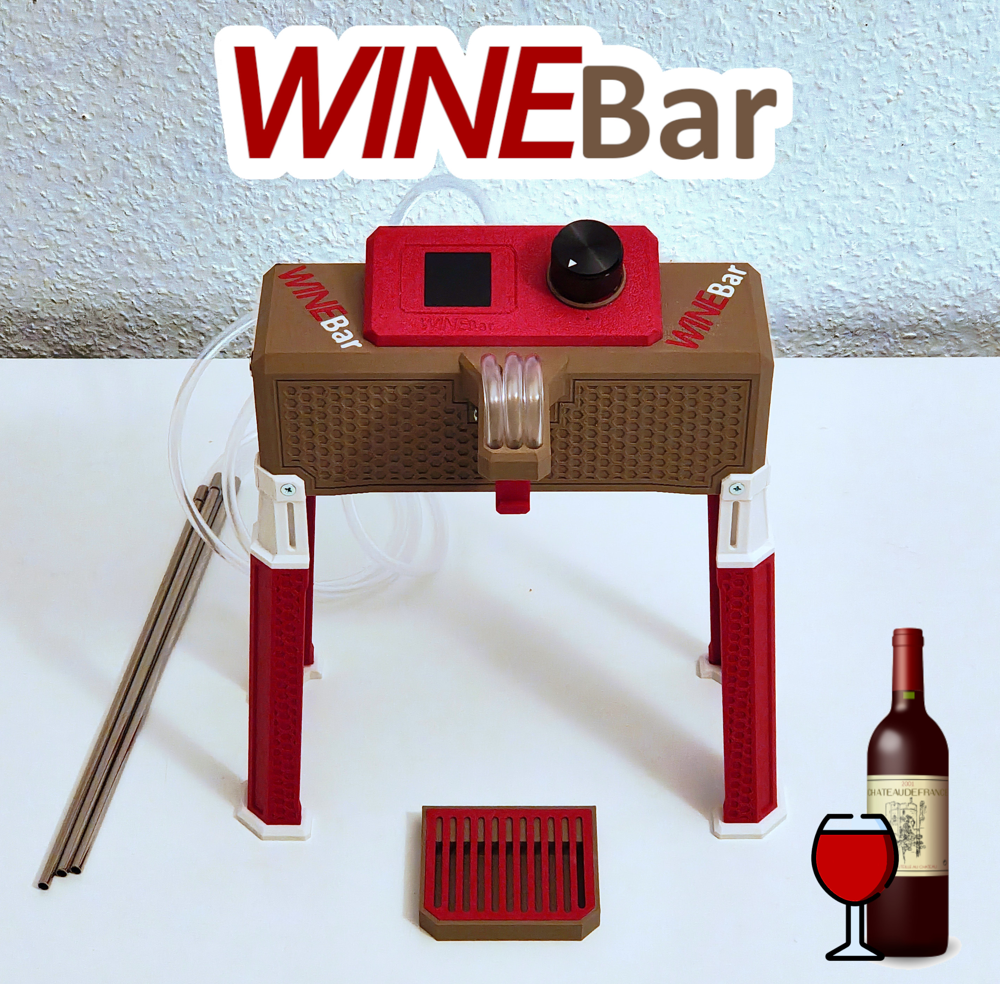
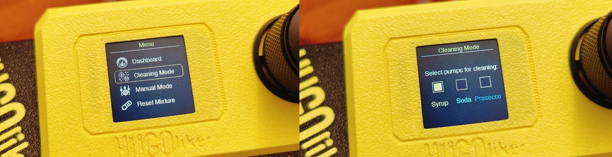
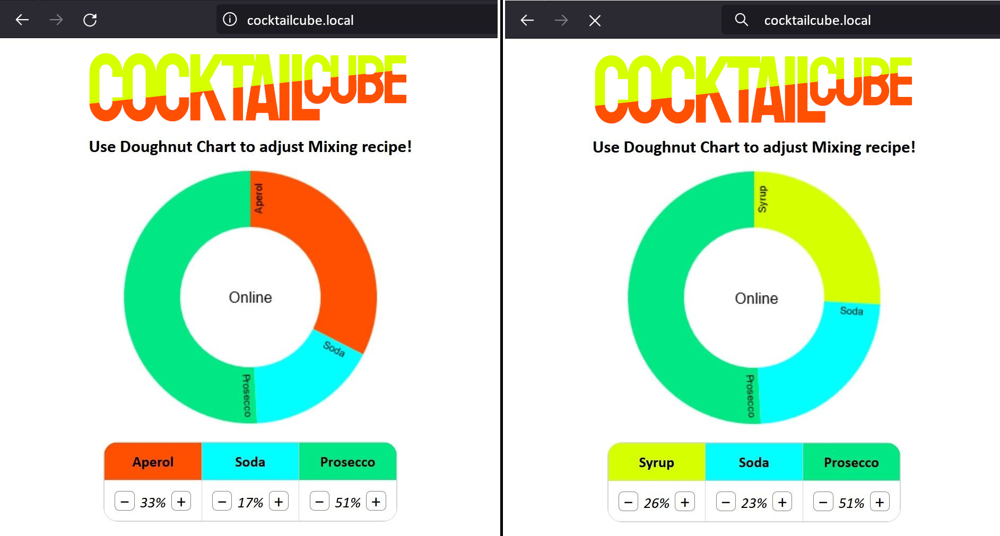
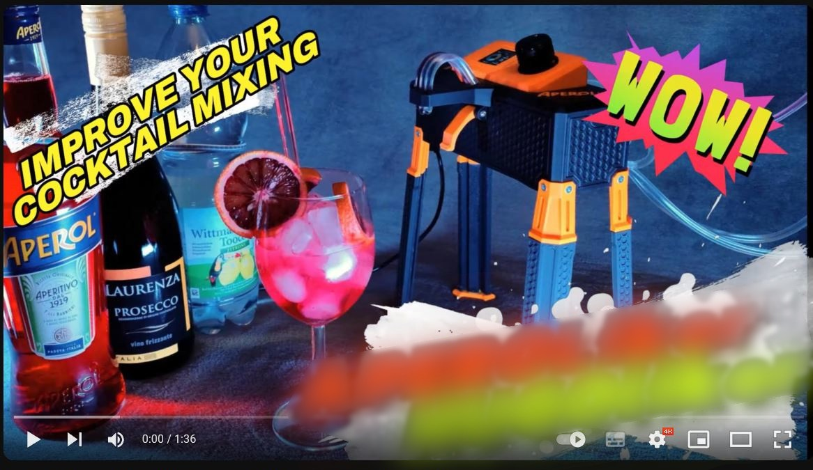
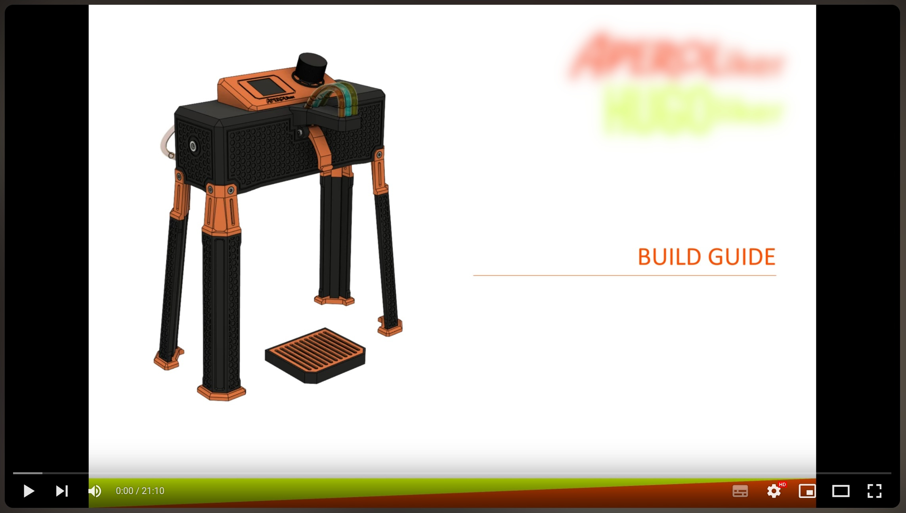

# CocktailCube
Sourcecode for CocktailCube Devices powered by ESP32S2 custom board (PCB)

You can download the 3D print files required for the assembly from Cults, printables or makerworld.

 | Link
-------- | --------
Cults: | <a href="https://cults3d.com/:XXXXXXXX">https://cults3d.com/:XXXXXXXX</a> 
Printables: | <a href="https://printables.com/XXXXXXXX">https://printables.com/:XXXXXXXX</a> 
Makerworld: | <a href="https://makerworld.com/XXXXXXXX">https://makerworld.com/:XXXXXXXX</a> 

You can buy the CocktailCube PCB from AliExpress

Version | Link
-------- | --------
Only PCB: | <a href="https://aliexpress.com/pcb">https://aliexpress.com/pcb</a> 
PCB + Kit: | <a href="https://aliexpress.com/pcb+kit">https://aliexpress.com/pcb+kit</a>

Releases:
* V1.0 - Features:
  - Initial Release
* V1.1 - Features:
  - Statemachine / complete display menu
  
* V1.2 - Features:
  - Wifi is now available! You can control the CocktailCube via access point. I will show a homepage under "\[mixername\].local". Additionally, you now can use the SPIFFS Uploader to upload the image and webpage files.
  

___

CocktailCube Promotion Video:

Link: <a href="https://youtu.be/noAwpnZ6lFE">https://youtu.be/noAwpnZ6lFE</a>

___

CocktailCube Build Guide (Deprecated):

Link: <a href="https://youtu.be/Se7SYwGe9iE">https://youtu.be/Se7SYwGe9iE</a>

___

FAQ:

* Q: First Question?

  A: Answer...
  
